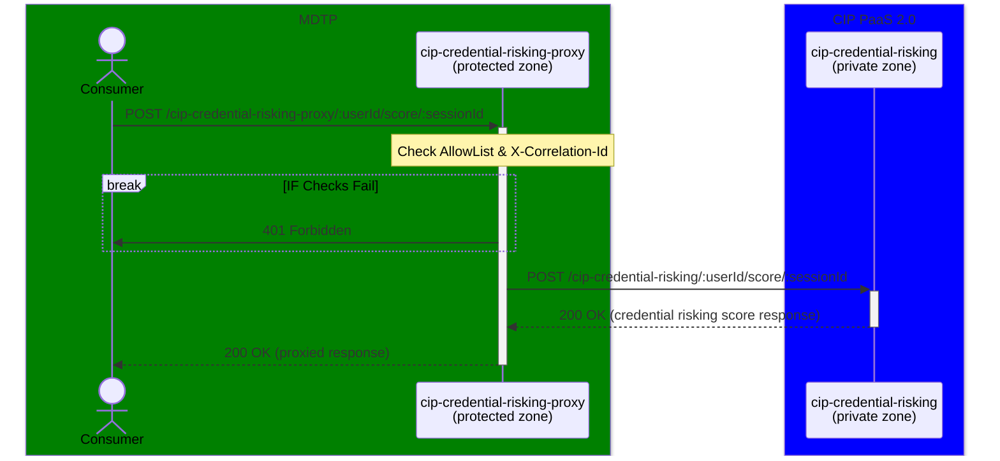
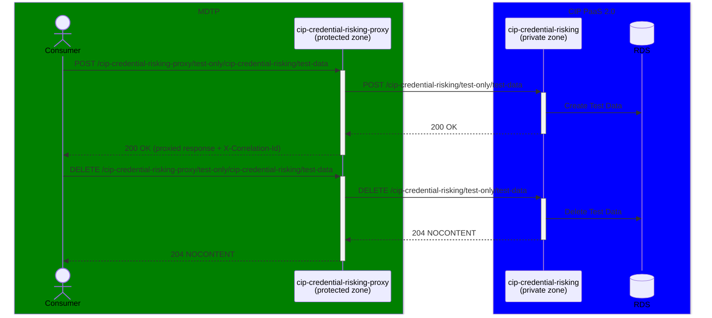

# cip-credential-risking-proxy

The `cip-credential-risking-proxy` service is a `protected` zone microservice used to forward risk scoring requests from MDTP to CIP in the `private` zone.

This service is the entry point to CIP credential risking services for internal consumers, both on MDTP and through the HMRC corporate tier. In both cases, a User-Agent is required to be able to access the service.
If the User-Agent is not authorised to access the service, please contact us to get access.

## Documentation

Consumer facing documentation will be made available on the HIP platform.

Downstream CIP documentation for the `cip-credential0risking` service can be found [here](https://github.com/hmrc/cip-credential-risking)

## Sequence Diagram

The following diagram shows how `cip-credential-risking-proxy` interacts with its downstream services

### Production APIs



### testOnly APIs

#### Credential risking score data management



## Unit testing
To run the unit tests for the application, use the following command:

```sbt test ```


## Integration testing
The integration tests depends on external services such as a Postgres database and AWS Secrets Manager. These tests
make use of TestContainers to spin up the required dependencies in Docker containers.

To run the integration tests, use the following command:

```sbt it/test```

## Code coverage

```sbt clean coverage test it/test coverageReport```

## Running locally
You'll need Postgres running locally on port `5432` and the dependant service `cip-credential-risking` started via SM2 to run this service locally.

To start Postgres locally, you can use the following Docker command:

```
docker rm -f credential-risking-postgres;
docker run --name credential-risking-postgres \
  -e POSTGRES_USER=postgres \
  -e POSTGRES_PASSWORD=postgres \
  -d -p 5432:5432 postgres
```

Start the dependant service `cip-credential-risking` locally via SM2:

```sm2 --start CIP_CREDENTIAL_RISKING```

To run the service locally, you can use the following command:

```./run_local.sh```

This repo also contains Bruno scripts to use for testing this service.

## Contact

Our preferred contact method is our public channel in HMRC Digital Slack: `#team-cip-insights-and-reputation`

If you do not have access to Slack, please email us at `cip-insights-and-reputation-g@digital.hmrc.gov.uk`

## Running locally

### **IMPORTANT** Pre-requisites (dependencies)

To run this service locally and integrated with the `cip-credential-risking` service, you will need to have the following dependencies running locally:
- A Postgres database running on port `5432` _(via docker is usually easiest)_
- `cip-credential-risking` started via SM2 _(which will create the DB and tables in postgres)_

Once the dependencies are running, you can use the `./run_local.sh` script provided within **this** repository to start the `cip-credential-risking-proxy` service

## License

This code is open source software licensed under the [Apache 2.0 License]("http://www.apache.org/licenses/LICENSE-2.0.html").